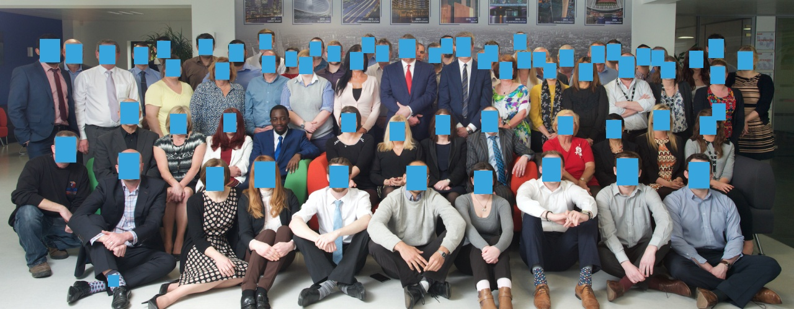

______________________________________________________________________________________
______________________________________________________________________________________

# Face Detection Microservice
______________________________________________________________________________________
* Inspiration
[see here](https://medium.com/@neerajshukla1911/create-face-detection-rest-api-in-1-minute-ff38b9c77bc1)

* Folder structure: 
   - mtcnn - MTCNN model files
   - app_mtcnn.py - main script
   - README.md
* Returns returns bounding boxes and accuracy of detected faces for a given image 
* It uses MTCNN Model for detecting faces
* API:  ```http://localhost:8000/face-detection```
* Request Parameter:
```
file: file object (Required)
show_anonymize_image: display anonymized faces in image (Optional)
```
______________________________________________________________________________
### How to use Face-Detection Microservice
###### CURL POST REQUEST TO USE FACE-DETECTION SERVICE:
..

```bash
curl http://localhost:8000/face-detection -F "file=@image.jpg" -F "show_anonymize_image=True" 
curl http://localhost:8000/face-detection -F "file=@image.jpg"
```
##### Response
..

```json
        {
            "predictions": [
                {   
                    "accuracy" : 99.60%,
                    "box": {
                        "xmax": 394,
                        "xmin": 305,
                        "ymax": 166,
                        "ymin": 76
                    }
                }
            ]
        } 
```

### Run Flask Server

```python
export FLASK_APP=app_mtcnn.py
export FLASK_ENV=dev

python app_mtcnn.py
```

### Result



### Dependencies 

* Flask
* skimage
* PIL
* Opencv
* mtcnn


